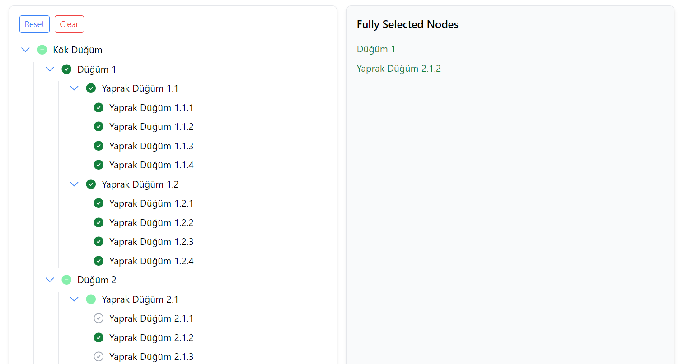

# React Tree Select Component

Bu proje, React kullanılarak yapılmış bir çoklu ve tekli seçim yapılabilen ağaç (tree) componenti içermektedir. Component, Tailwind CSS ile stillendirilmiş olup, state yönetimi için opsiyonel olarak ek paketler kullanılabilir.

## Kurulum

Projeyi yerel ortamınıza klonlamak için:

git clone https://github.com/fatmaturan/tree-component.git

cd tree-select-component
npm install

## Çalıştırma

Projeyi yerel ortamda çalıştırmak için:

npm start

## Örnek Senaryo

Eğer sadece id 3 seçili ise, id 1 ve id 2 yarı seçilmiş, id 8, 9, 10, 11 seçilmiş olarak görünür. Seçim listesinde sadece id 3 bulunur.

Eğer id 9 seçimi kaldırılırsa, id 3 yarı seçilmiş olur ve seçim listesine girer. id 8, 10, 11 seçilmiş kalır.

## Proje Görüntüsü

